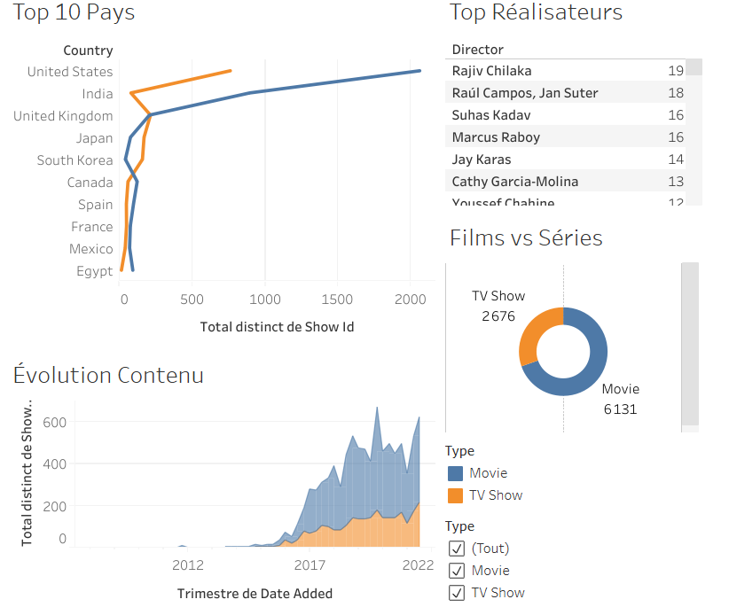

# Analyse du Catalogue Netflix avec Tableau

Un dashboard interactif conçu sur Tableau Public pour explorer le catalogue de films et de séries Netflix. Ce projet met en œuvre un processus complet de Business Intelligence, de la préparation des données à la création d'un dashboard interactif et intuitif.

## 🚀 Dashboard Interactif sur Tableau Public

**[Cliquez ici pour explorer le dashboard interactif]([https://public.tableau.com/app/profile/jacques.wu/viz/AnalyseduCatalogueNetflix/Tableaudebord1?publish=yes])**

*(Veuillez noter que le chargement peut prendre quelques secondes. Le dashboard est optimisé pour un affichage sur ordinateur.)*

---

## 📸 Aperçu du Dashboard

---

## 🎯 Objectif du Projet

Ce projet vise à répondre à plusieurs questions clés sur le catalogue Netflix en utilisant les fonctionnalités de Tableau :
*   Quelle est la répartition entre les films et les séries TV ?
*   Quels sont les pays qui produisent le plus de contenu ?
*   Comment l'offre de contenu a-t-elle évolué au fil du temps ?
*   Quels sont les réalisateurs et acteurs les plus prolifiques ?

---

## 🛠️ Compétences Mises en Œuvre

*   **Préparation des Données :** Nettoyage des données, gestion des types et assignation des rôles géographiques directement dans Tableau.
*   **Visualisation Avancée :** Création de graphiques pertinents (diagramme en donut, barres, aires) pour représenter les données.
*   **Interactivité :** Mise en place de filtres globaux et d'actions de filtrage "graphique à graphique" pour permettre une exploration dynamique et intuitive des données.
*   **Publication :** Partage du projet via la plateforme Tableau Public.

---

## 📂 Contenu du Dépôt

*   **`Analyse du Catalogue Netflix.twbx`** : Le classeur Tableau empaqueté. Ce fichier contient le dashboard et les données. Il peut être ouvert avec Tableau Public Desktop pour explorer la construction du projet en détail.
*   **`.png`** : La capture d'écran du dashboard final.
*   **`README.md`** : Ce fichier de présentation.
